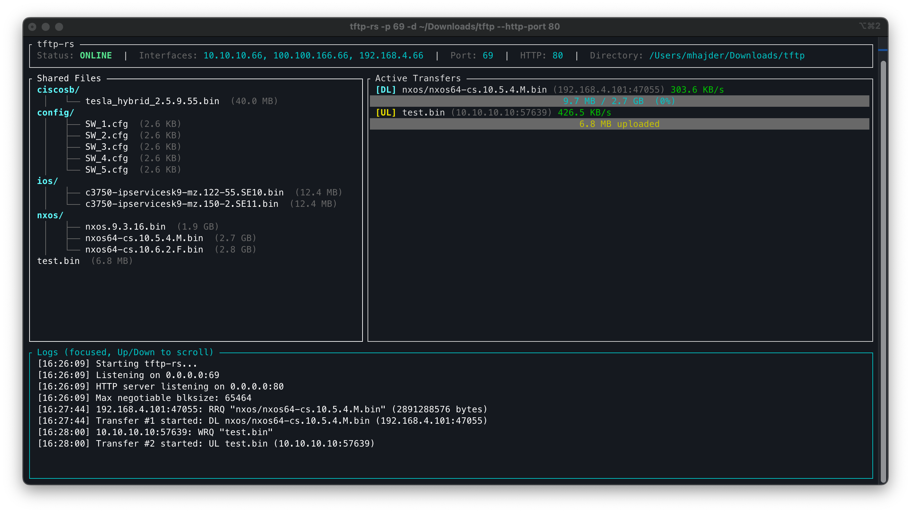

# tftp-rs

A high-performance, single-binary TFTP server with a real-time TUI dashboard. Implements the TFTP protocol from scratch with full support for both Read (RRQ) and Write (WRQ) operations, RFC 2347/2348 option negotiation, and an optional HTTP file server.

## Features

- **RFC 1350 compliant** -- hand-rolled TFTP protocol, no external TFTP crates
- **RFC 2347/2348 option negotiation** -- blksize up to 65,464 bytes, tsize (transfer size) reporting for dramatically faster transfers
- **Full RRQ + WRQ** -- serve files to clients (download) and receive files from clients (upload)
- **Subdirectory support** -- read and write files in nested directories (e.g. `ios/config/router.cfg`)
- **Async I/O** -- built on `tokio` with non-blocking UDP sockets
- **Ephemeral transfer sockets** -- each transfer gets its own OS-assigned port, keeping the main listener free
- **HTTP file server** -- optional HTTP server for browser-based directory browsing and file downloads (`--http-port`)
- **TUI dashboard** -- real-time view of server status, shared files tree, active transfers with progress bars, and timestamped scrollable logs
- **Interface discovery** -- displays all non-loopback network interface IPs in the header (auto-refreshes every 10 seconds)
- **Scrollable panels** -- Tab to cycle focus between Shared Files, Active Transfers, and Logs panels; Up/Down to scroll
- **Log file export** -- optionally write all logs to a file with `--log-file`
- **Path sanitization** -- prevents directory traversal attacks
- **Retransmission** -- automatic retry with configurable timeout on lost ACKs/DATA

## Screenshot



## Installation

### From source

```bash
git clone https://github.com/mhajder/tftp-rs.git
cd tftp-rs
cargo build --release
```

The binary will be at `target/release/tftp-rs`.

### From GitHub Releases

Download a pre-built binary for your platform from the [Releases](https://github.com/mhajder/tftp-rs/releases) page.

## Usage

```bash
# Serve the current directory on port 69 (default)
tftp-rs

# Serve a specific directory on a custom port
tftp-rs -p 69 -d /srv/tftp

# Enable log file output
tftp-rs -d /srv/tftp -l /var/log/tftp.log

# Enable HTTP file server alongside TFTP
tftp-rs -d /srv/tftp --http-port 8080

# All options combined
tftp-rs -p 69 -d /srv/tftp -l /var/log/tftp.log --http-port 8080
```

### CLI Options

```
Options:
  -p, --port <PORT>          UDP port to listen on [default: 69]
  -d, --dir <DIR>            Directory to serve / receive files [default: .]
  -l, --log-file <LOG_FILE>  Optional file path to write logs to
      --http-port <PORT>     Enable HTTP file server on the specified port
  -h, --help                 Print help
  -V, --version              Print version
```

### TUI Controls

| Key              | Action                                  |
|------------------|-----------------------------------------|
| `q` / `Esc`      | Open quit confirmation dialog          |
| `Tab`            | Cycle focus between panels              |
| `Up` / `Down`    | Scroll the focused panel               |
| `Left` / `Right` | Toggle Yes/No in quit dialog           |
| `Enter`          | Confirm selection in quit dialog        |
| `y`              | Confirm quit                            |
| `n`              | Cancel quit                             |

### Testing with a TFTP client

```bash
# Download a file from the server
tftp localhost 69
> get filename.txt

# Download a file from a subdirectory
tftp localhost 69
> get configs/switches/sw1.cfg

# Upload a file to the server
tftp localhost 69
> put localfile.txt

# Upload a file into a subdirectory (created automatically)
tftp localhost 69
> put configs/new_config.cfg
```

## Architecture

```
src/
  main.rs              Entry point, CLI args (clap), TUI event loop
  tftp_protocol.rs     TFTP packet parsing/serialization (RFC 1350, 2347, 2348)
  server.rs            Async TFTP server (tokio), RRQ + WRQ handlers
  http_server.rs       Optional HTTP file server (axum)
  ui.rs                TUI dashboard (ratatui + crossterm)
tests/
  integration.rs       End-to-end RRQ/WRQ integration tests
```

### Protocol Implementation

All TFTP packet types are manually parsed and serialized with Big-Endian byte order:

| Opcode | Type  | Description                                  |
|--------|-------|----------------------------------------------|
| 1      | RRQ   | Read request (client download)               |
| 2      | WRQ   | Write request (client upload)                |
| 3      | DATA  | Data payload (up to 65,464-byte blocks)      |
| 4      | ACK   | Acknowledgment                               |
| 5      | ERROR | Error notification                           |
| 6      | OACK  | Option acknowledgment (RFC 2347)             |

### Option Negotiation (RFC 2347/2348)

When a client includes options in its RRQ/WRQ request, the server responds with an OACK packet acknowledging the supported options:

- **blksize** -- block size from 8 to 65,464 bytes (default: 512). Larger blocks dramatically improve throughput.
- **tsize** -- the server reports the total file size in the OACK for downloads, allowing the client to display progress.

## Tech Stack

- **Rust** 2024 edition
- **tokio** -- async UDP and TCP I/O
- **ratatui** + **crossterm** -- terminal UI
- **axum** -- HTTP file server
- **clap** -- CLI argument parsing
- **anyhow** -- error handling
- **if-addrs** -- network interface discovery

## License

MIT
