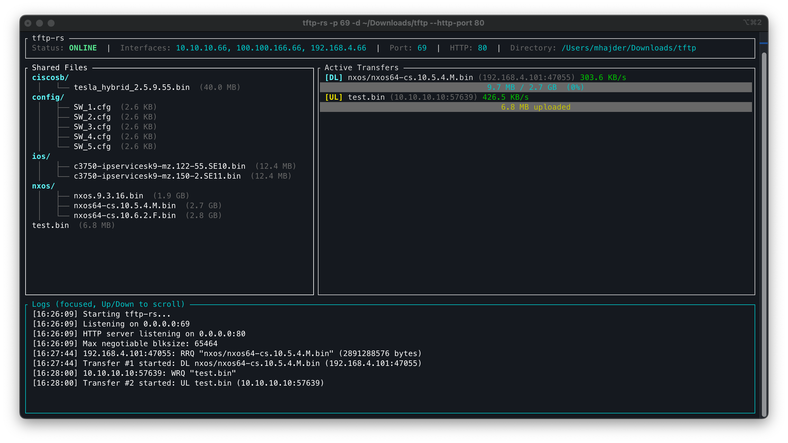

# tftp-rs

A high-performance, single-binary TFTP server with a real-time TUI dashboard. Implements the TFTP protocol from scratch with full support for both Read (RRQ) and Write (WRQ) operations, RFC option negotiation (blksize, timeout, tsize, windowsize), netascii mode, and an optional HTTP file server.

## Implemented RFCs

| RFC | Description |
|-----|-------------|
| [RFC 1350](https://www.rfc-editor.org/rfc/rfc1350) | The TFTP Protocol (Revision 2) |
| [RFC 2347](https://www.rfc-editor.org/rfc/rfc2347) | TFTP Option Extension |
| [RFC 2348](https://www.rfc-editor.org/rfc/rfc2348) | TFTP Blocksize Option |
| [RFC 2349](https://www.rfc-editor.org/rfc/rfc2349) | TFTP Timeout Interval and Transfer Size Options |
| [RFC 7440](https://www.rfc-editor.org/rfc/rfc7440) | TFTP Windowsize Option |

## Features

- **RFC 1350 compliant** -- hand-rolled TFTP protocol, no external TFTP crates
- **RFC 2347/2348 option negotiation** -- blksize up to 65,464 bytes; capped via `--max-block-size` for VPN environments
- **RFC 2349 timeout + tsize** -- clients can negotiate a custom reply timeout; tsize reports file size on downloads and is echoed on uploads
- **RFC 7440 windowsize** -- windowed transfers send multiple DATA blocks before waiting for ACK, significantly improving throughput on high-latency links
- **Netascii mode** -- full bidirectional conversion (`\n` ↔ `\r\n`, `\r` ↔ `\r\0`) across block boundaries for legacy clients
- **Unlimited transfer size** -- block numbers roll over correctly (u16 wrap-around), enabling files larger than 32 MB with the default 512-byte block size
- **Full RRQ + WRQ** -- serve files to clients (download) and receive files from clients (upload)
- **Subdirectory support** -- read and write files in nested directories (e.g. `ios/config/router.cfg`)
- **Async I/O** -- built on `tokio` with non-blocking UDP sockets
- **Ephemeral transfer sockets** -- each transfer gets its own OS-assigned port, keeping the main listener free
- **Request deduplication** -- duplicate requests from the same peer are silently dropped while a transfer is already in progress
- **Overwrite protection** -- WRQ for existing files can be rejected with `--no-allow-overwrite` (returns error code 6)
- **Access control** -- `--disable-read` or `--disable-write` to restrict what operations clients may perform
- **Configurable retransmission** -- `--timeout` (ms) and `--max-retries` to tune behaviour for unstable networks
- **HTTP file server** -- optional HTTP server for browser-based directory browsing and file downloads (`--http-port`)
- **TUI dashboard** -- real-time view of server status, shared files tree, active transfers with progress bars, and timestamped scrollable logs
- **Interface discovery** -- displays all non-loopback network interface IPs in the header (auto-refreshes every 10 seconds)
- **Scrollable panels** -- Tab to cycle focus between Shared Files, Active Transfers, and Logs panels; Up/Down to scroll
- **Log file export** -- optionally write all logs to a file with `--log-file`
- **Path sanitization** -- prevents directory traversal attacks

## Screenshot



## Installation

### From source

```bash
git clone https://github.com/mhajder/tftp-rs.git
cd tftp-rs
cargo build --release
```

The binary will be at `target/release/tftp-rs`.

### From GitHub Releases

Download a pre-built binary for your platform from the [Releases](https://github.com/mhajder/tftp-rs/releases) page.

## Usage

```bash
# Serve the current directory on port 69 (default)
tftp-rs

# Serve a specific directory on a custom port
tftp-rs -p 69 -d /srv/tftp

# Enable log file output
tftp-rs -d /srv/tftp -l /var/log/tftp.log

# Enable HTTP file server alongside TFTP
tftp-rs -d /srv/tftp --http-port 8080

# Enable windowed transfers (RFC 7440) for faster throughput
tftp-rs -d /srv/tftp -w 4

# Set a lower timeout for fast/unstable links
tftp-rs -d /srv/tftp -t 200

# Limit blksize (useful behind VPNs with small MTU)
tftp-rs -d /srv/tftp --max-block-size 1468

# Reject uploads for existing files
tftp-rs -d /srv/tftp --allow-overwrite false

# All options combined
tftp-rs -p 69 -d /srv/tftp -l /var/log/tftp.log --http-port 8080 -w 4 -t 200
```

### CLI Options

```
Options:
  -p, --port <PORT>                  UDP port to listen on [default: 69]
  -d, --dir <DIR>                    Directory to serve / receive files [default: .]
  -l, --log-file <LOG_FILE>          Optional file path to write logs to
      --http-port <PORT>             Enable HTTP file server on the specified port
  -t, --timeout <MS>                 Reply timeout in milliseconds [default: 500]
      --max-block-size <BYTES>       Max negotiable blksize (0 = OS auto-detect) [default: 0]
  -w, --max-window-size <N>          Max RFC 7440 window size (1 = disable) [default: 1]
      --allow-overwrite              Allow overwriting existing files on WRQ [default: true]
      --max-retries <N>              Max retransmission attempts [default: 10]
      --disable-read                 Reject all RRQ (download) requests
      --disable-write                Reject all WRQ (upload) requests
  -h, --help                         Print help
  -V, --version                      Print version
```

### TUI Controls

| Key              | Action                                  |
|------------------|-----------------------------------------|
| `q` / `Esc`      | Open quit confirmation dialog          |
| `Tab`            | Cycle focus between panels              |
| `Up` / `Down`    | Scroll the focused panel               |
| `Left` / `Right` | Toggle Yes/No in quit dialog           |
| `Enter`          | Confirm selection in quit dialog        |
| `y`              | Confirm quit                            |
| `n`              | Cancel quit                             |

### Testing with a TFTP client

```bash
# Download a file from the server
tftp localhost 69
> get filename.txt

# Download a file from a subdirectory
tftp localhost 69
> get configs/switches/sw1.cfg

# Upload a file to the server
tftp localhost 69
> put localfile.txt

# Upload a file into a subdirectory (created automatically)
tftp localhost 69
> put configs/new_config.cfg
```

## Architecture

```
src/
  main.rs              Entry point, CLI args (clap), TUI event loop
  tftp_protocol.rs     TFTP packet parsing/serialization + netascii codec
                       (RFC 1350, 2347, 2348, 2349, 7440)
  server.rs            Async TFTP server (tokio), RRQ + WRQ handlers,
                       option negotiation, windowed transfer, ServerConfig
  http_server.rs       Optional HTTP file server (axum)
  ui.rs                TUI dashboard (ratatui + crossterm)
tests/
  integration.rs       End-to-end RRQ/WRQ integration tests including
                       blksize/tsize negotiation and block-number rollover
```

### Protocol Implementation

All TFTP packet types are manually parsed and serialized with Big-Endian byte order:

| Opcode | Type  | Description                                  |
|--------|-------|----------------------------------------------|
| 1      | RRQ   | Read request (client download)               |
| 2      | WRQ   | Write request (client upload)                |
| 3      | DATA  | Data payload (up to 65,464-byte blocks)      |
| 4      | ACK   | Acknowledgment                               |
| 5      | ERROR | Error notification                           |
| 6      | OACK  | Option acknowledgment (RFC 2347)             |

### Option Negotiation

When a client includes options in its RRQ/WRQ request, the server responds with an OACK packet acknowledging the negotiated values before data transfer begins.

| Option | RFC | Description |
|--------|-----|-------------|
| `blksize` | 2348 | Block payload size, 8–65,464 bytes (default 512). Capped by `--max-block-size` and OS UDP limit. |
| `timeout` | 2349 | Per-transfer reply timeout in seconds (1–255). Overrides the server default for that transfer. |
| `tsize` | 2349 | On RRQ: server reports actual file size. On WRQ: server echoes back the client's value. |
| `windowsize` | 7440 | Number of DATA blocks sent before waiting for an ACK. Capped by `--max-window-size`. |

### Windowed Transfer (RFC 7440)

With `--max-window-size N` (N > 1), the server sends up to N DATA blocks before pausing for an ACK. Partial ACKs within a window slide it forward without retransmitting the already-acknowledged blocks. On timeout, the entire unacknowledged window is retransmitted. This significantly improves throughput on high-latency links.

### Netascii Mode

The server fully supports the `netascii` transfer mode:
- **Download (RRQ):** binary data is encoded on the fly (`\n` → `\r\n`, `\r` → `\r\0`) with overflow tracking across block boundaries.
- **Upload (WRQ):** incoming netascii data is decoded to binary (`\r\n` → `\n`, `\r\0` → `\r`) with carry-over state for `\r` spanning two consecutive blocks.

### Block Number Roll-over

Block numbers are 16-bit unsigned integers. The server uses `wrapping_add(1)` on every block increment, enabling files of unlimited size with any block size (e.g. a file larger than 32 MB with the default 512-byte blksize requires block numbers to wrap past 65535).

## Tech Stack

- **Rust** 2024 edition
- **tokio** -- async UDP and TCP I/O
- **ratatui** + **crossterm** -- terminal UI
- **axum** -- HTTP file server
- **clap** -- CLI argument parsing
- **anyhow** -- error handling
- **if-addrs** -- network interface discovery

## License

MIT
